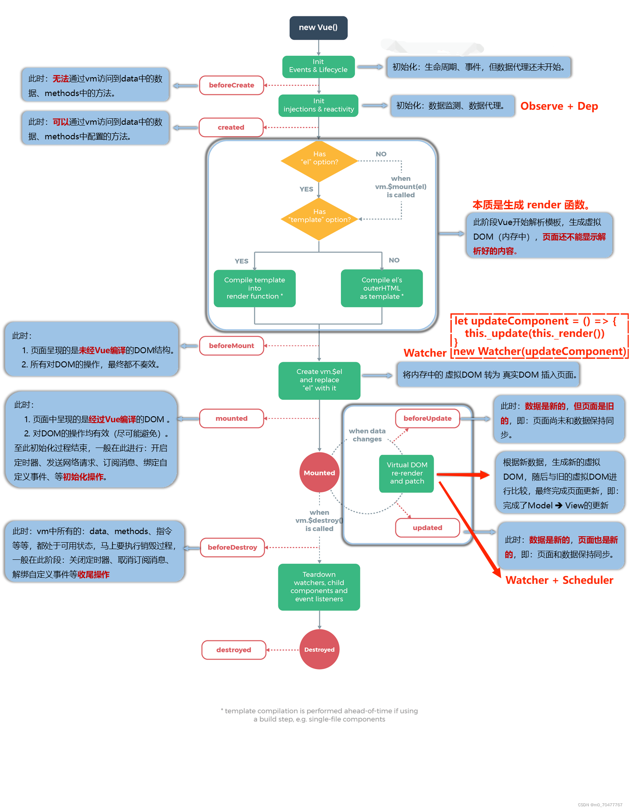
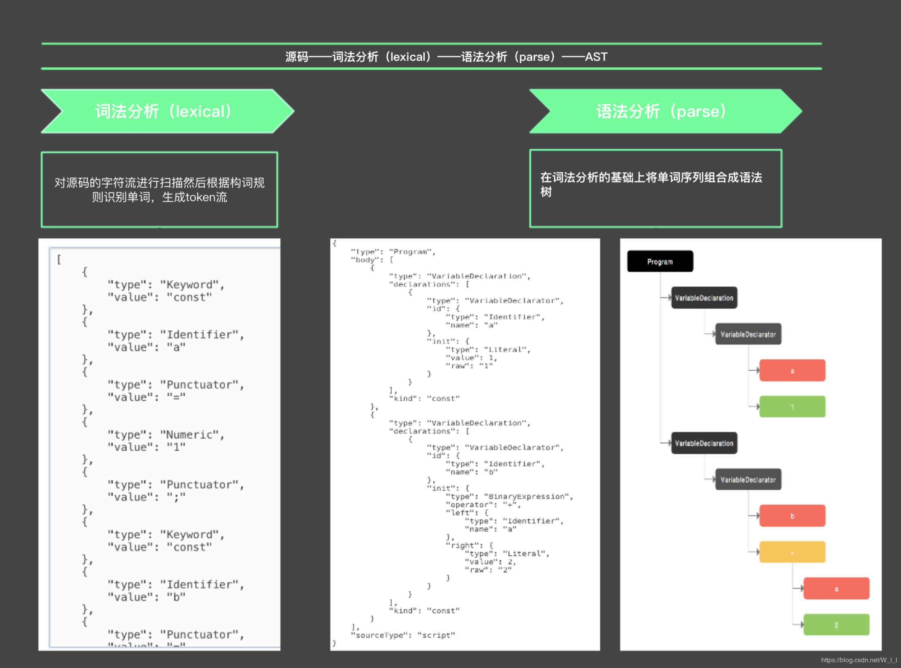

## Vue2 的响应式原理




## Object.defineProperty

```javascript
Object.defineProperty(obj, prop, descriptor)
  obj：必需。要定义或修改的属性的对象。
  prop：必需。要定义或修改的属性的属性名。
  descriptor：必需。要定义或修改的属性的描述符。
```

**存取器 getter/setter**

```javascript
var obj = {}
var value = 'hello'

Object.defineProperty(obj, 'key', {
  // 当获取 obj['key'] 值的时候触发该函数。
  get: function() {
    return value
  },
  // 当设置 obj['key'] 值的时候触发该函数。
  set: function(newValue) {
    value = newValue
  }
})
```

​		注意：不要在 getter 中获取该属性的值，也不要在 setter 中设置该属性的值，否则会发生栈溢出。

## 实现数据代理和劫持

```javascript
class Vue {
  constructor(options) {
    this.$options = options
    this.initData()
  }

  initData() {
    // TODO：this.$options.data 还可能是一个函数。
    const data = (this._data = this.$options.data)
    const keys = Object.keys(data)
    for (let i = 0; i < keys.length; i++) {
      // 数据代理逻辑。
      Object.defineProperty(this, keys[i], {
        enumerable: true,
        configurable: true,
        get: function proxyGetter() {
          return data[keys[i]]
        },
        set: function proxySetter(newValue) {
          data[keys[i]] = newValue
        }
      })
      // 数据劫持逻辑。
      let value = data[keys[i]]
      Object.defineProperty(data, keys[i], {
        enumerable: true,
        configurable: true,
        get: function reactiveGetter() {
          console.log(`获取了 data 的 ${keys[i]} 值。`)
          return value
        },
        set: function reactiveSetter(newValue) {
          console.log(`设置了 data 的 ${keys[i]} 值。`)
          value = newValue
        }
      })
    }
  }
}
```

## 实现数据代理和递归劫持

​		首先将数据递归劫持逻辑抽离到 observe 工厂函数中；然后新定义一个 Observer 类，为后续的工作做铺垫。

```javascript
class Vue {
  constructor(options) {
    this.$options = options
    this.initData()
  }

  initData() {
    // TODO：this.$options.data 还可能是一个函数。
    const data = (this._data = this.$options.data)
    const keys = Object.keys(data)
    for (let i = 0; i < keys.length; i++) {
      // 数据代理逻辑。
      Object.defineProperty(this, keys[i], {
        enumerable: true,
        configurable: true,
        get: function proxyGetter() {
          return data[keys[i]]
        },
        set: function proxySetter(newValue) {
          data[keys[i]] = newValue
        }
      })
    }

    observe(data)
  }
}

// 观察 data 数据。
function observe(data) {
  const type = Object.prototype.toString.call(data)
  if (type !== '[object Object]' && type !== '[object Array]') {
    return
  }
  new Observer(data)
}

// TODO：数组的观察逻辑暂时还没实现。
class Observer {
  constructor(data) {
    this.walk(data)
  }

  walk(data) {
    const keys = Object.keys(data)
    for (let i = 0; i < keys.length; i++) {
      defineReactive(data, keys[i], data[keys[i]])
    }
  }
}

// 定义 obj 对象的 key 属性的响应式。
// 这里利用了闭包，使得 value 变量一直没有被垃圾回收。
function defineReactive(obj, key, value) {
  // 深度优先遍历。
  observe(value)

  // 数据劫持逻辑。
  Object.defineProperty(obj, key, {
    enumerable: true,
    configurable: true,
    get: function reactiveGetter() {
      console.log(`获取了 ${key} 值。`)
      return value
    },
    set: function reactiveSetter(newValue) {
      console.log(`设置了 ${key} 值。`)
      observe(newValue)
      value = newValue
    }
  })
}
```

## 实现 watch 监听

​		下面是 Vue 中的 watch 选项与 $watch 方法的实现原理。（暂时只实现了对 vm.$options.data 对象的第一层属性的监听。）

​		每个响应式属性都有一个属于自己的“筐”。在该响应式属性被其他回调函数依赖的时候，Vue 会通过这个“筐”的 depend 方法把这些回调函数添加到这个“筐”的 subs 属性中。在该响应式属性的值发生变化的时候，Vue 会通过这个“筐”的 notify 方法把这个“筐”的 subs 属性中的这些回调函数取出来全部执行。

​		在 Vue 中，“筐”被抽象成了 Dep 实例，回调函数被包装成了 Watcher 实例。

```javascript
class Vue {
  constructor(options) {
    this.$options = options
    this.initData()
    this.initWatch()
  }

  initData() {
    // TODO：this.$options.data 还可能是一个函数。
    const data = (this._data = this.$options.data)
    const keys = Object.keys(data)
    for (let i = 0; i < keys.length; i++) {
      // 数据代理逻辑。
      Object.defineProperty(this, keys[i], {
        enumerable: true,
        configurable: true,
        get: function proxyGetter() {
          return data[keys[i]]
        },
        set: function proxySetter(newValue) {
          data[keys[i]] = newValue
        }
      })
    }

    observe(data)
  }

  initWatch() {
    const watch = this.$options.watch
    if (watch) {
      const keys = Object.keys(watch)
      for (let i = 0; i < keys.length; i++) {
        this.$watch(keys[i], watch[keys[i]])
      }
    }
  }

  $watch(exp, cb) {
    new Watcher(this, exp, cb)
  }
}

// 观察 data 数据。
function observe(data) {
  const type = Object.prototype.toString.call(data)
  if (type !== '[object Object]' && type !== '[object Array]') {
    return
  }
  new Observer(data)
}

// TODO：数组的观察逻辑暂时还没实现。
class Observer {
  constructor(data) {
    this.walk(data)
  }

  walk(data) {
    const keys = Object.keys(data)
    for (let i = 0; i < keys.length; i++) {
      defineReactive(data, keys[i], data[keys[i]])
    }
  }
}

// 定义 obj 对象的 key 属性的响应式。
// 这里利用了闭包，使得 value 变量 和 dep 常量一直没有被垃圾回收。
function defineReactive(obj, key, value) {
  const dep = new Dep()

  // 深度优先遍历。
  observe(value)

  // 数据劫持逻辑。
  Object.defineProperty(obj, key, {
    enumerable: true,
    configurable: true,
    get: function reactiveGetter() {
      // 订阅逻辑。
      dep.depend()
      return value
    },
    set: function reactiveSetter(newValue) {
      if (value === newValue) {
        return
      }
      // 发布逻辑。
      dep.notify()
      observe(newValue)
      value = newValue
    }
  })
}

// “筐”被抽象成了 Dep 实例。
class Dep {
  // 响应式属性当前要订阅的 watcher。
  static target = null

  constructor() {
    // 响应式属性已订阅的 watcher 列表。
    this.subs = []
  }

  depend() {
    if (Dep.target) {
      this.subs.push(Dep.target)
    }
  }

  notify() {
    this.subs.forEach(watcher => {
      watcher.run()
    })
  }
}

// 回调函数被包装成了 Watcher 实例。
// TODO：暂时只实现了对 vm.$options.data 对象的第一层属性的监听。
class Watcher {
  constructor(vm, exp, cb) {
    this.vm = vm
    this.exp = exp
    this.cb = cb
    this.get()
  }

  get() {
    Dep.target = this
    this.vm[this.exp]
    Dep.target = null
  }

  run() {
    this.cb.call(this.vm)
  }
}
```

​		在 Vue 中：1、被包装成 Watcher 实例的回调函数是被异步调用的；2、在该回调函数被异步调用之后和实际执行之前的这个过程中，如果触发该回调函数的响应式属性的值又被修改了，那么这些后续的修改操作将无法再次触发该回调函数的调用。所以 Watcher 类的实现原理，实际如下代码所示：

```javascript
// 回调函数被包装成了 Watcher 实例。
// TODO：暂时只实现了对 vm.$options.data 对象的第一层属性的监听。
const watcherQueue = []
let watcherId = 0
class Watcher {
  constructor(vm, exp, cb) {
    this.id = ++watcherId
    this.vm = vm
    this.exp = exp
    this.cb = cb
    this.get()
  }

  get() {
    Dep.target = this
    this.vm[this.exp]
    Dep.target = null
  }

  run() {
    if (watcherQueue.indexOf(this.id) !== -1) {
      // 类似于 JavaScript 中的防抖逻辑。
      return
    }
    watcherQueue.push(this.id)
    const index = watcherQueue.length - 1
    Promise.resolve().then(() => {
      this.cb.call(this.vm)
      watcherQueue.splice(index, 1)
    })
  }
}
```

## 仍然存在的问题

​		至此，基本实现了 Vue 中基于发布订阅的 watch 监听逻辑。但目前仍然存在以下问题：1、**对象的新增属性**没有被添加数据劫持逻辑；2、**数组元素**的数据劫持逻辑还存在问题。因此在对对象的新增属性和数组元素添加监听逻辑时也会存在问题。

## 实现 $set 方法

​		在 Vue 中，如果响应式属性的值是一个对象（包括数组），那么在该响应式属性上就会被挂载一个 _ ob _ 属性，该 _ ob _ 属性的值是一个 Observer 实例，该 Observer 实例的 dep 属性的值是一个 Dep 实例，该 Dep 实例是和 defineReactive 方法的闭包中的 Dep 实例不同的与该响应式属性绑定的另外一个“筐”。

​		当响应式属性的值是一个对象（包括数组）时，Vue 会把触发该响应式属性的 getter 的 watchers 额外收集一份在该响应式属性的 _ ob _ 属性的 dep 属性的 subs 属性中。这样开发者就可以通过代码**命令式**地去触发这个响应式属性的 watchers 了。


**$set 方法的实现思路基本如下：**

​		1、在创建 Observer 对象的实例去观察响应式属性时，同时也创建一个 Dep 对象的实例。先将该 Dep 对象的实例挂载到该 Observer 对象的实例上，然后把该 Observer 对象的实例挂载到它自己观察的响应式属性上。

​		2、当响应式属性的 getter 被触发时，把与该响应式属性绑定的“筐”的 depend 方法调用一遍。响应式属性的值为对象或数组时，有两个筐；响应式属性的值不为对象和数组时，有一个筐。

​		3、当用户调用 $set 方法时，如果 target 为对象，则 Vue 先调用 defineReactive 方法把设置的属性也定义为响应式，然后调用 target._ ob _.dep.notify 方法触发 target 的 watchers。（target 为数组的情况暂时未实现。）

```javascript
class Vue {
  constructor(options) {
    this.$options = options
    this.initData()
    this.initWatch()
  }

  initData() {
    // TODO：this.$options.data 还可能是一个函数。
    const data = (this._data = this.$options.data)
    const keys = Object.keys(data)
    for (let i = 0; i < keys.length; i++) {
      // 数据代理逻辑。
      Object.defineProperty(this, keys[i], {
        enumerable: true,
        configurable: true,
        get: function proxyGetter() {
          return data[keys[i]]
        },
        set: function proxySetter(newValue) {
          data[keys[i]] = newValue
        }
      })
    }

    observe(data)
  }

  initWatch() {
    const watch = this.$options.watch
    if (watch) {
      const keys = Object.keys(watch)
      for (let i = 0; i < keys.length; i++) {
        this.$watch(keys[i], watch[keys[i]])
      }
    }
  }

  $watch(exp, cb) {
    new Watcher(this, exp, cb)
  }

  // TODO：暂时只实现了 target 为对象的情况，target 为数组的情况还未实现。
  $set(target, key, value) {
    defineReactive(target, key, value)
    // 触发依赖 target 的 watchers。
    target.__ob__.dep.notify()
  }
}

// 观察 data 数据。
function observe(data) {
  const type = Object.prototype.toString.call(data)
  if (type !== '[object Object]' && type !== '[object Array]') {
    return
  }
  return new Observer(data)
}

// TODO：数组的观察逻辑暂时还没实现。
class Observer {
  constructor(data) {
    this.dep = new Dep()
    Object.defineProperty(data, '__ob__', {
      enumerable: false,
      configurable: false,
      value: this,
      writable: true
    })
    this.walk(data)
  }

  walk(data) {
    const keys = Object.keys(data)
    for (let i = 0; i < keys.length; i++) {
      defineReactive(data, keys[i], data[keys[i]])
    }
  }
}

// 定义 obj 对象的 key 属性的响应式。
// 这里利用了闭包，使得 value 变量 和 dep 常量一直没有被垃圾回收。
function defineReactive(obj, key, value) {
  const dep = new Dep()

  // 深度优先遍历。
  const objKeyOb = observe(value)

  if (objKeyOb && obj[key] && obj[key].__ob__) {
    objKeyOb.dep = obj[key].__ob__.dep
  }

  // 数据劫持逻辑。
  Object.defineProperty(obj, key, {
    enumerable: true,
    configurable: true,
    get: function reactiveGetter() {
      // 订阅逻辑。
      dep.depend()
      if (objKeyOb) {
        objKeyOb.dep.depend()
      }
      return value
    },
    set: function reactiveSetter(newValue) {
      if (value === newValue) {
        return
      }
      // 发布逻辑。
      dep.notify()
      const objKeyOb = observe(newValue)
      if (objKeyOb && obj[key] && obj[key].__ob__) {
        objKeyOb.dep = obj[key].__ob__.dep
      }
      value = newValue
    }
  })
}

// “筐”被抽象成了 Dep 实例。
class Dep {
  // 响应式属性当前要订阅的 watcher。
  static target = null

  constructor() {
    // 响应式属性已订阅的 watcher 列表。
    this.subs = []
  }

  depend() {
    if (Dep.target) {
      this.subs.push(Dep.target)
    }
  }

  notify() {
    this.subs.forEach(watcher => {
      watcher.run()
    })
  }
}

// 回调函数被包装成了 Watcher 实例。
// TODO：暂时只实现了对 vm.$options.data 对象的第一层属性的监听。
const watcherQueue = []
let watcherId = 0
class Watcher {
  constructor(vm, exp, cb) {
    this.id = ++watcherId
    this.vm = vm
    this.exp = exp
    this.cb = cb
    this.get()
  }

  get() {
    Dep.target = this
    this.vm[this.exp]
    Dep.target = null
  }

  run() {
    if (watcherQueue.indexOf(this.id) !== -1) {
      // 类似于 JavaScript 中的防抖逻辑。
      return
    }
    watcherQueue.push(this.id)
    const index = watcherQueue.length - 1
    Promise.resolve().then(() => {
      this.cb.call(this.vm)
      watcherQueue.splice(index, 1)
    })
  }
}
```

## 实现数组方法的重写

**Vue 对数组的处理思路基本如下：**

​		1、对数组本身不使用 Object.defineProperty 方法进行数据劫持，对数组元素依次使用 observe 方法进行数据观察。因此，**数组元素不具有响应性，数组元素的属性仍然具有响应性**。

​		2、对数组的 push、pop、shift、unshift、splice、sort、reverse 实例方法进行重写。在这些重写的实例方法中，Vue 先调用数组的原始同名实例方法，然后再调用 this._ ob _.dep.notify 方法去触发该数组的 watchers。

```javascript
class Vue {
  constructor(options) {
    this.$options = options
    this.initData()
    this.initWatch()
  }

  initData() {
    // TODO：this.$options.data 还可能是一个函数。
    const data = (this._data = this.$options.data)
    const keys = Object.keys(data)
    for (let i = 0; i < keys.length; i++) {
      // 数据代理逻辑。
      Object.defineProperty(this, keys[i], {
        enumerable: true,
        configurable: true,
        get: function proxyGetter() {
          return data[keys[i]]
        },
        set: function proxySetter(newValue) {
          data[keys[i]] = newValue
        }
      })
    }

    observe(data)
  }

  initWatch() {
    const watch = this.$options.watch
    if (watch) {
      const keys = Object.keys(watch)
      for (let i = 0; i < keys.length; i++) {
        this.$watch(keys[i], watch[keys[i]])
      }
    }
  }

  $watch(exp, cb) {
    new Watcher(this, exp, cb)
  }

  $set(target, key, value) {
    const type = Object.prototype.toString.call(target)
    if (type !== '[object Object]' && type !== '[object Array]') {
      return
    }
    if (type === '[object Array]') {
      const arratProto = Array.prototype
      observe(value)
      arratProto.splice.call(target, key, 1, value)
    } else if (type === '[object Object]') {
      defineReactive(target, key, value)
    }
    // 触发依赖 target 的 watchers。
    target.__ob__.dep.notify()
  }
}

// 观察 data 数据。
function observe(data) {
  const type = Object.prototype.toString.call(data)
  if (type !== '[object Object]' && type !== '[object Array]') {
    return
  }
  return new Observer(data)
}

class Observer {
  constructor(data) {
    this.dep = new Dep()
    Object.defineProperty(data, '__ob__', {
      enumerable: false,
      configurable: false,
      value: this,
      writable: true
    })
    const type = Object.prototype.toString.call(data)
    if (type === '[object Array]') {
      data.__proto__ = arrayMethods
      this.observeArray(data)
    } else if (type === '[object Object]') {
      this.walk(data)
    }
  }

  walk(data) {
    const keys = Object.keys(data)
    for (let i = 0; i < keys.length; i++) {
      defineReactive(data, keys[i], data[keys[i]])
    }
  }

  observeArray(array) {
    for (let i = 0; i < array.length; i++) {
      observe(array[i])
    }
  }
}

// 定义 obj 对象的 key 属性的响应式。
// 这里利用了闭包，使得 value 变量 和 dep 常量一直没有被垃圾回收。
function defineReactive(obj, key, value) {
  const dep = new Dep()

  // 深度优先遍历。
  const objKeyOb = observe(value)

  if (objKeyOb && obj[key] && obj[key].__ob__) {
    objKeyOb.dep = obj[key].__ob__.dep
  }

  // 数据劫持逻辑。
  Object.defineProperty(obj, key, {
    enumerable: true,
    configurable: true,
    get: function reactiveGetter() {
      // 订阅逻辑。
      dep.depend()
      if (objKeyOb) {
        objKeyOb.dep.depend()
      }
      return value
    },
    set: function reactiveSetter(newValue) {
      if (value === newValue) {
        return
      }
      // 发布逻辑。
      dep.notify()
      const objKeyOb = observe(newValue)
      if (objKeyOb && obj[key] && obj[key].__ob__) {
        objKeyOb.dep = obj[key].__ob__.dep
      }
      value = newValue
    }
  })
}

// “筐”被抽象成了 Dep 实例。
class Dep {
  // 响应式属性当前要订阅的 watcher。
  static target = null

  constructor() {
    // 响应式属性已订阅的 watcher 列表。
    this.subs = []
  }

  depend() {
    if (Dep.target) {
      this.subs.push(Dep.target)
    }
  }

  notify() {
    this.subs.forEach(watcher => {
      watcher.run()
    })
  }
}

// 回调函数被包装成了 Watcher 实例。
// TODO：暂时只实现了对 vm.$options.data 对象的第一层属性的监听。
const watcherQueue = []
let watcherId = 0
class Watcher {
  constructor(vm, exp, cb) {
    this.id = ++watcherId
    this.vm = vm
    this.exp = exp
    this.cb = cb
    this.get()
  }

  get() {
    Dep.target = this
    this.vm[this.exp]
    Dep.target = null
  }

  run() {
    if (watcherQueue.indexOf(this.id) !== -1) {
      // 类似于 JavaScript 中的防抖逻辑。
      return
    }
    watcherQueue.push(this.id)
    const index = watcherQueue.length - 1
    Promise.resolve().then(() => {
      this.cb.call(this.vm)
      watcherQueue.splice(index, 1)
    })
  }
}

const mutationMethods = ['push', 'pop', 'shift', 'unshift', 'splice', 'sort', 'reverse']
const arrayProto = Array.prototype
const arrayMethods = Object.create(arrayProto)
mutationMethods.forEach(method => {
  arrayMethods[method] = function(...args) {
    if (method === 'push' || method === 'unshift' || method === 'splice') {
      this.__ob__.observeArray(args)
    }
    const result = arrayProto[method].apply(this, args)
    this.__ob__.dep.notify()
    return result
  }
})
```

## 实现 computed 计算属性

**Vue 中 computed 计算属性的特性：**

​		1、计算属性不存在于 data 选项中，因此计算属性需要单独进行初始化。

​		2、计算属性的值是一个函数运行之后的返回值。

​		3、计算属性的值“只能取，不能存”，即计算属性的 setter 无效。

​		4、计算属性所依赖的响应式属性的值，一旦发生变化，便会引起该计算属性的值，一同发生变化。

​		5、计算属性是**惰性**的：计算属性所依赖的响应式属性的值发生变化时，不会立即引起该计算属性的值一同发生变化，而是等到该计算属性的值被获取时才会使得 Vue 对它的值进行重新计算。

​		6、计算属性是**缓存**的：如果计算属性所依赖的响应式属性的值没有发生变化，即使多次获取该计算属性的值，Vue 也不会对该计算属性的值进行重新计算。

**注：对于计算属性 A 依赖计算属性 B 的情况，下面的代码好像已经实现了，但还需进一步的测试验证。**

```javascript
class Vue {
  constructor(options) {
    this.$options = options
    this.initData()
    this.initComputed()
    this.initWatch()
  }

  initData() {
    // TODO：this.$options.data 还可能是一个函数。
    const data = (this._data = this.$options.data)
    const keys = Object.keys(data)
    for (let i = 0; i < keys.length; i++) {
      // 数据代理逻辑。
      Object.defineProperty(this, keys[i], {
        enumerable: true,
        configurable: true,
        get: function proxyGetter() {
          return data[keys[i]]
        },
        set: function proxySetter(newValue) {
          data[keys[i]] = newValue
        }
      })
    }

    observe(data)
  }

  initComputed() {
    const computed = this.$options.computed
    if (computed) {
      const keys = Object.keys(computed)
      for (let i = 0; i < keys.length; i++) {
        const watcher = new Watcher(this, computed[keys[i]], function() {}, { lazy: true })
        Object.defineProperty(this, keys[i], {
          enumerable: true,
          configurable: true,
          get: function computedGetter() {
            if (watcher.dirty) {
              watcher.get()
              watcher.dirty = false
            }
            watcher.deps.forEach(dep => {
              dep.depend()
            })
            return watcher.value
          },
          set: function computedSetter() {
            console.warn('请不要给计算属性赋值!')
          }
        })
      }
    }
  }

  initWatch() {
    const watch = this.$options.watch
    if (watch) {
      const keys = Object.keys(watch)
      for (let i = 0; i < keys.length; i++) {
        this.$watch(keys[i], watch[keys[i]])
      }
    }
  }

  $watch(exp, cb) {
    new Watcher(this, exp, cb)
  }

  $set(target, key, value) {
    const type = Object.prototype.toString.call(target)
    if (type !== '[object Object]' && type !== '[object Array]') {
      return
    }
    if (type === '[object Array]') {
      const arratProto = Array.prototype
      observe(value)
      arratProto.splice.call(target, key, 1, value)
    } else if (type === '[object Object]') {
      defineReactive(target, key, value)
    }
    // 触发依赖 target 的 watchers。
    target.__ob__.dep.notify()
  }
}

// 观察 data 数据。
function observe(data) {
  const type = Object.prototype.toString.call(data)
  if (type !== '[object Object]' && type !== '[object Array]') {
    return
  }
  return new Observer(data)
}

class Observer {
  constructor(data) {
    this.dep = new Dep()
    Object.defineProperty(data, '__ob__', {
      enumerable: false,
      configurable: false,
      value: this,
      writable: true
    })
    const type = Object.prototype.toString.call(data)
    if (type === '[object Array]') {
      data.__proto__ = arrayMethods
      this.observeArray(data)
    } else if (type === '[object Object]') {
      this.walk(data)
    }
  }

  walk(data) {
    const keys = Object.keys(data)
    for (let i = 0; i < keys.length; i++) {
      defineReactive(data, keys[i], data[keys[i]])
    }
  }

  observeArray(array) {
    for (let i = 0; i < array.length; i++) {
      observe(array[i])
    }
  }
}

// 定义 obj 对象的 key 属性的响应式。
// 这里利用了闭包，使得 value 变量 和 dep 常量一直没有被垃圾回收。
function defineReactive(obj, key, value) {
  const dep = new Dep()

  // 深度优先遍历。
  const objKeyOb = observe(value)

  if (objKeyOb && obj[key] && obj[key].__ob__) {
    objKeyOb.dep = obj[key].__ob__.dep
  }

  // 数据劫持逻辑。
  Object.defineProperty(obj, key, {
    enumerable: true,
    configurable: true,
    get: function reactiveGetter() {
      // 订阅逻辑。
      dep.depend()
      if (objKeyOb) {
        objKeyOb.dep.depend()
      }
      return value
    },
    set: function reactiveSetter(newValue) {
      if (value === newValue) {
        return
      }
      // 发布逻辑。
      dep.notify()
      const objKeyOb = observe(newValue)
      if (objKeyOb && obj[key] && obj[key].__ob__) {
        objKeyOb.dep = obj[key].__ob__.dep
      }
      value = newValue
    }
  })
}

// “筐”被抽象成了 Dep 实例。
class Dep {
  // 响应式属性当前要订阅的 watcher。
  static target = null

  constructor() {
    // 响应式属性已订阅的 watcher 列表。
    this.subs = []
  }

  depend() {
    if (Dep.target) {
      Dep.target.addDep(this)
    }
  }

  addSub(watcher) {
    if (this.subs.indexOf(watcher) !== -1) {
      return
    }
    this.subs.push(watcher)
  }

  notify() {
    this.subs.forEach(watcher => {
      watcher.update()
    })
  }
}

// 回调函数被包装成了 Watcher 实例。
// TODO：暂时只实现了对 vm.$options.data 对象的第一层属性的监听。
const watcherQueue = []
let watcherId = 0
const targetStack = []
class Watcher {
  constructor(vm, exp, cb, options = {}) {
    this.id = ++watcherId
    this.vm = vm
    this.exp = exp
    this.cb = cb
    this.deps = []
    this.value = null
    this.lazy = this.dirty = !!options.lazy
    if (!this.lazy) {
      this.get()
    }
  }

  get() {
    Dep.target = this
    targetStack.push(this)
    if (typeof this.exp === 'function') {
      this.value = this.exp.call(this.vm)
    } else {
      this.value = this.vm[this.exp]
    }
    targetStack.pop()
    if (targetStack.length > 0) {
      Dep.target = targetStack[targetStack.length - 1]
    } else {
      Dep.target = null
    }
  }

  addDep(dep) {
    if (this.deps.indexOf(dep) !== -1) {
      return
    }
    this.deps.push(dep)
    dep.addSub(this)
  }

  update() {
    if (this.lazy) {
      this.dirty = true
    } else {
      this.run()
    }
  }

  run() {
    if (watcherQueue.indexOf(this.id) !== -1) {
      // 类似于 JavaScript 中的防抖逻辑。
      return
    }
    watcherQueue.push(this.id)
    const index = watcherQueue.length - 1
    Promise.resolve().then(() => {
      // 更新 this.value(watcher.value) 的值。
      this.get()
      this.cb.call(this.vm)
      watcherQueue.splice(index, 1)
    })
  }
}

const mutationMethods = ['push', 'pop', 'shift', 'unshift', 'splice', 'sort', 'reverse']
const arrayProto = Array.prototype
const arrayMethods = Object.create(arrayProto)
mutationMethods.forEach(method => {
  arrayMethods[method] = function(...args) {
    if (method === 'push' || method === 'unshift' || method === 'splice') {
      this.__ob__.observeArray(args)
    }
    const result = arrayProto[method].apply(this, args)
    this.__ob__.dep.notify()
    return result
  }
})
```

## Vue 模板响应式更新的原理

​		Vue 对模板的响应式更新，就是如同代码中的 initRenderWatch 方法这样做的。在 Vue 中，响应式更新模板的 watcher 被称为 render watcher，该 watcher 的求值函数比代码中的 initRenderWatch 方法中的 watcher 的求值函数复杂的多。

```javascript
class Vue {
  constructor(options) {
    this.$options = options
    this.initData()
    this.initComputed()
    this.initWatch()
    this.initRenderWatch()
  }

  initData() {
    // TODO：this.$options.data 还可能是一个函数。
    const data = (this._data = this.$options.data)
    const keys = Object.keys(data)
    for (let i = 0; i < keys.length; i++) {
      // 数据代理逻辑。
      Object.defineProperty(this, keys[i], {
        enumerable: true,
        configurable: true,
        get: function proxyGetter() {
          return data[keys[i]]
        },
        set: function proxySetter(newValue) {
          data[keys[i]] = newValue
        }
      })
    }

    observe(data)
  }

  initComputed() {
    const computed = this.$options.computed
    if (computed) {
      const keys = Object.keys(computed)
      for (let i = 0; i < keys.length; i++) {
        const watcher = new Watcher(this, computed[keys[i]], function() {}, { lazy: true })
        Object.defineProperty(this, keys[i], {
          enumerable: true,
          configurable: true,
          get: function computedGetter() {
            if (watcher.dirty) {
              watcher.get()
              watcher.dirty = false
            }
            watcher.deps.forEach(dep => {
              dep.depend()
            })
            return watcher.value
          },
          set: function computedSetter() {
            console.warn('请不要给计算属性赋值!')
          }
        })
      }
    }
  }

  initWatch() {
    const watch = this.$options.watch
    if (watch) {
      const keys = Object.keys(watch)
      for (let i = 0; i < keys.length; i++) {
        this.$watch(keys[i], watch[keys[i]])
      }
    }
  }

  initRenderWatch() {
    new Watcher(
      this,
      () => {
        document.querySelector('#app').innerHTML = `<p>${this.name}</p>`
      },
      () => {}
    )
  }

  $watch(exp, cb) {
    new Watcher(this, exp, cb)
  }

  $set(target, key, value) {
    const type = Object.prototype.toString.call(target)
    if (type !== '[object Object]' && type !== '[object Array]') {
      return
    }
    if (type === '[object Array]') {
      const arrayProto = Array.prototype
      observe(value)
      arrayProto.splice.call(target, key, 1, value)
    } else if (type === '[object Object]') {
      defineReactive(target, key, value)
    }
    // 触发依赖 target 的 watchers。
    target.__ob__.dep.notify()
  }
}

// 观察 data 数据。
function observe(data) {
  const type = Object.prototype.toString.call(data)
  if (type !== '[object Object]' && type !== '[object Array]') {
    return
  }
  return new Observer(data)
}

class Observer {
  constructor(data) {
    this.dep = new Dep()
    Object.defineProperty(data, '__ob__', {
      enumerable: false,
      configurable: false,
      value: this,
      writable: true
    })
    const type = Object.prototype.toString.call(data)
    if (type === '[object Array]') {
      data.__proto__ = arrayMethods
      this.observeArray(data)
    } else if (type === '[object Object]') {
      this.walk(data)
    }
  }

  walk(data) {
    const keys = Object.keys(data)
    for (let i = 0; i < keys.length; i++) {
      defineReactive(data, keys[i], data[keys[i]])
    }
  }

  observeArray(array) {
    for (let i = 0; i < array.length; i++) {
      observe(array[i])
    }
  }
}

// 定义 obj 对象的 key 属性的响应式。
// 这里利用了闭包，使得 value 变量 和 dep 常量一直没有被垃圾回收。
function defineReactive(obj, key, value) {
  const dep = new Dep()

  // 深度优先遍历。
  const objKeyOb = observe(value)

  if (objKeyOb && obj[key] && obj[key].__ob__) {
    objKeyOb.dep = obj[key].__ob__.dep
  }

  // 数据劫持逻辑。
  Object.defineProperty(obj, key, {
    enumerable: true,
    configurable: true,
    get: function reactiveGetter() {
      // 订阅逻辑。
      dep.depend()
      if (objKeyOb) {
        objKeyOb.dep.depend()
      }
      return value
    },
    set: function reactiveSetter(newValue) {
      if (value === newValue) {
        return
      }
      // 发布逻辑。
      dep.notify()
      const objKeyOb = observe(newValue)
      if (objKeyOb && obj[key] && obj[key].__ob__) {
        objKeyOb.dep = obj[key].__ob__.dep
      }
      value = newValue
    }
  })
}

// “筐”被抽象成了 Dep 实例。
class Dep {
  // 响应式属性当前要订阅的 watcher。
  static target = null

  constructor() {
    // 响应式属性已订阅的 watcher 列表。
    this.subs = []
  }

  depend() {
    if (Dep.target) {
      Dep.target.addDep(this)
    }
  }

  addSub(watcher) {
    if (this.subs.indexOf(watcher) !== -1) {
      return
    }
    this.subs.push(watcher)
  }

  notify() {
    this.subs.forEach(watcher => {
      watcher.update()
    })
  }
}

// 回调函数被包装成了 Watcher 实例。
// TODO：暂时只实现了对 vm.$options.data 对象的第一层属性的监听。
const watcherQueue = []
let watcherId = 0
const targetStack = []
class Watcher {
  constructor(vm, exp, cb, options = {}) {
    this.id = ++watcherId
    this.vm = vm
    this.exp = exp
    this.cb = cb
    this.deps = []
    this.value = null
    this.lazy = this.dirty = !!options.lazy
    if (!this.lazy) {
      this.get()
    }
  }

  get() {
    Dep.target = this
    targetStack.push(this)
    if (typeof this.exp === 'function') {
      this.value = this.exp.call(this.vm)
    } else {
      this.value = this.vm[this.exp]
    }
    targetStack.pop()
    if (targetStack.length > 0) {
      Dep.target = targetStack[targetStack.length - 1]
    } else {
      Dep.target = null
    }
  }

  addDep(dep) {
    if (this.deps.indexOf(dep) !== -1) {
      return
    }
    this.deps.push(dep)
    dep.addSub(this)
  }

  update() {
    if (this.lazy) {
      this.dirty = true
    } else {
      this.run()
    }
  }

  run() {
    if (watcherQueue.indexOf(this.id) !== -1) {
      // 类似于 JavaScript 中的防抖逻辑。
      return
    }
    watcherQueue.push(this.id)
    const index = watcherQueue.length - 1
    Promise.resolve().then(() => {
      // 更新 this.value(watcher.value) 的值。
      this.get()
      this.cb.call(this.vm)
      watcherQueue.splice(index, 1)
    })
  }
}

const mutationMethods = ['push', 'pop', 'shift', 'unshift', 'splice', 'sort', 'reverse']
const arrayProto = Array.prototype
const arrayMethods = Object.create(arrayProto)
mutationMethods.forEach(method => {
  arrayMethods[method] = function(...args) {
    if (method === 'push' || method === 'unshift' || method === 'splice') {
      this.__ob__.observeArray(args)
    }
    const result = arrayProto[method].apply(this, args)
    this.__ob__.dep.notify()
    return result
  }
})
```

**Vue 对模板响应式更新的处理思路基本如下：**

​		1、**模板编译：**如果传入了 template 或者 DOM，那么在 Vue 实例化的过程中，Vue 首先会把模板字符串转化成渲染函数（vm.$options.render）。

​		2、**虚拟 DOM：**Vue 借助这个渲染函数去响应式更新模板的时候，如果 Vue 直接去操作 DOM，那么会极大的消耗浏览器的性能。于是 Vue 引入 Virtual-DOM (虚拟 DOM），借助它来实现对 DOM 的按需更新。

## 实现模板编译

​		如果传入了 template 或者 DOM，那么在 Vue 实例化的过程中，Vue 首先会把模板字符串转化成渲染函数（vm.$options.render），这个过程就是 Vue 的**模板编译**。

​		Vue 模板编译的整体逻辑主要分为三个步骤：1、**解析器：**将**模板字符串**转换成 **AST**。2、**优化器：**对 **AST** 进行静态节点标记。主要是为了优化渲染性能。（这里不做介绍）3、**代码生成器：**将 **AST** 转换成 **render** 函数。


### **AST**

​		AST，即抽象语法树，是源代码语法结构的抽象表示。[JS AST 在线生成](https://astexplorer.net/)

​		Vue 中 AST 的代码示例如下：

```javascript
{
  children: [{…}], // 叶子节点没有 children 属性。
  parent: {}, // 根节点的 parent 属性的值为 undefined。
  tag: "div", // 元素节点的专属属性。
  type: 1, // 1：元素节点。2：带变量的文本节点。3：纯文本节点。
  expression:'"姓名：" + _s(name)', // 文本节点的专属属性。如果 type 值是 3，则 expression 值为 ''。
  text:'姓名：{{name}}' // 文本节点的专属属性。text 值为文本节点编译前的字符串。
}
```

### **解析器（parser）**

​		源代码被解析成 AST 的过程一般包含两个步骤：词法分析和语法分析。



​		Vue 中的解析器对模板字符串进行解析时，是每产生一个 token 便会立即对该 token 进行处理，即词法分析和语法分析同时进行，或者说没有词法分析只有语法分析。

​		下面以最单纯的 HTML 模板为例，阐述 Vue 中的解析器将模板字符串转换成 AST 的原理。（v-model、v-bind、v-if、v-for、@click 以及 HTML 中的单标签元素、DOM 属性、HTML 注释等情况都不予以考虑。）

​		**解析思路：**以 < 为标识符，代表开始标签或结束标签。使用栈结构去维护当前模板被解析到的层级。如果是开始标签，代表 AST 的层级 push 了一层；如果是结束标签，代表  AST  的层级 pop 了一层。

```javascript
function parse(template) {
  let root = null
  let currentParent
  const stack = []

  // 跳过空白字符串。
  template = template.trim()

  while (template) {
    const ltIndex = template.indexOf('<')
    // ltIndex === -1 的情况不会出现。
    // ltIndex > 0 标签前面有文本节点。
    // ltIndex === 0 && template[ltIndex + 1] !== '/' 开始标签。
    // ltIndex === 0 && template[ltIndex + 1] === '/' 结束标签。
    if (ltIndex > 0) {
      // type：1-元素节点；2-带变量的文本节点；3-纯文本节点。
      const text = template.slice(0, ltIndex)
      const element = parseText(text)
      element.parent = currentParent
      if (!currentParent.children) {
        currentParent.children = []
      }
      currentParent.children.push(element)
      template = template.slice(ltIndex)
    } else if (ltIndex === 0 && template[ltIndex + 1] !== '/') {
      const gtIndex = template.indexOf('>')
      const element = {
        parent: currentParent, // 根节点的 parent 属性值为 undefined。
        tag: template.slice(ltIndex + 1, gtIndex), // 只考虑开始标签中没有任何属性的情况。
        type: 1
      }
      if (currentParent) {
        if (!currentParent.children) {
          currentParent.children = []
        }
        currentParent.children.push(element)
      } else {
        root = element
      }
      currentParent = element
      stack.push(element)
      template = template.slice(gtIndex + 1)
    } else if (ltIndex === 0 && template[ltIndex + 1] === '/') {
      const gtIndex = template.indexOf('>')
      // parse 函数执行完毕后 stack 值被设置为 []。
      stack.pop()
      // parse 函数执行完毕后 currentParent 值被设置为 undefined。
      currentParent = stack[stack.length - 1]
      // parse 函数执行完毕后 template 值被设置为 ''。
      template = template.slice(gtIndex + 1)
    }
  }

  return root
}

// 以 {{ 和 }} 为标识符，把 text 中的 '姓名：{{name}}' 转换成 '"姓名：" + _s(name)'。
function parseText(text) {
  const originText = text
  const tokens = []
  // type：2-带变量的文本节点；3-纯文本节点。
  let type = 3

  while (text) {
    const start = text.indexOf('{{')
    const end = text.indexOf('}}')
    if (start !== -1) {
      type = 2
      if (start > 0) {
        tokens.push(JSON.stringify(text.slice(0, start)))
      }
      const exp = text.slice(start + 2, end)
      tokens.push(`_s(${exp})`)
      text = text.slice(end + 2)
    } else {
      tokens.push(JSON.stringify(text))
      text = ''
    }
  }

  const element = {
    parent: null,
    type,
    expression: type === 2 ? tokens.join(' + ') : '',
    text: originText
  }

  return element
}
```

### render

​		本小结生成的 render 函数的函数体字符串是这样的：

​				**'with (this) { return \_c("div", {}, [\_c("p", {}, [\_v("姓名：" + \_s(name))])]) }'。**

​		其中 \_c 函数的第三个参数的空值是 []，不是 undefined。

### **代码生成器（codegenerator）**

​		**生成思路：**1、遍历 AST，对 AST 中的每个节点进行处理。2、遇到元素节点生成 **_c("标签名", 属性对象, 后代数组)** 格式的字符串。（后代数组为空时为 []，而不是 undefined。）3、遇到纯文本节点生成 **_v("文本字符串")** 格式的字符串。4、遇到带变量的文本节点生成 **_v(\_s(变量名))** 格式的字符串。5、为了让字符串中的变量能够在 render 函数中被正常取值，在遍历完 AST 后， 将生成的字符串整体外包一层 **with(this)**。6、将经过 with(this) 包装处理后的字符串作为函数体，生成一个 **render 函数**，并将这个 render 函数挂载到 **vm.$options** 上。

```javascript
// 将 AST 转换为 render 函数的函数体的字符串。
function generate(ast) {
  const code = genNode(ast)
  return {
    render: `with (this) { return ${code} }`
  }
}

// 转换节点。
function genNode(node) {
  if (node.type === 1) {
    return genElement(node)
  } else {
    return genText(node)
  }
}

// 转换元素节点。
function genElement(node) {
  const children = genChildren(node)
  // children 的空值是 '[]'，不是 'undefined'。
  const code = `_c(${JSON.stringify(node.tag)}, {}, ${children})`
  return code
}

// 转换文本节点。
function genText(node) {
  if (node.type === 2) {
    return `_v(${node.expression})`
  } else if (node.type === 3) {
    return `_v(${JSON.stringify(node.text)})`
  }
}

// 转换元素节点的子节点列表中的子节点。
function genChildren(node) {
  // node.children 的空值为 undefined。
  if (node.children) {
    return '[' + node.children.map(child => genNode(child)).join(', ') + ']'
  } else {
    return '[]'
  }
}
```

```javascript
class Vue {
  constructor(options) {
    this.$options = options
    this.initData()
    this.initComputed()
    this.initWatch()
    this.initRenderFunction()
    // this.initRenderWatch()
  }

  initData() {
    // TODO：this.$options.data 还可能是一个函数。
    const data = (this._data = this.$options.data)
    const keys = Object.keys(data)
    for (let i = 0; i < keys.length; i++) {
      // 数据代理逻辑。
      Object.defineProperty(this, keys[i], {
        enumerable: true,
        configurable: true,
        get: function proxyGetter() {
          return data[keys[i]]
        },
        set: function proxySetter(newValue) {
          data[keys[i]] = newValue
        }
      })
    }

    observe(data)
  }

  initComputed() {
    const computed = this.$options.computed
    if (computed) {
      const keys = Object.keys(computed)
      for (let i = 0; i < keys.length; i++) {
        const watcher = new Watcher(this, computed[keys[i]], function() {}, { lazy: true })
        Object.defineProperty(this, keys[i], {
          enumerable: true,
          configurable: true,
          get: function computedGetter() {
            if (watcher.dirty) {
              watcher.get()
              watcher.dirty = false
            }
            watcher.deps.forEach(dep => {
              dep.depend()
            })
            return watcher.value
          },
          set: function computedSetter() {
            console.warn('请不要给计算属性赋值!')
          }
        })
      }
    }
  }

  initWatch() {
    const watch = this.$options.watch
    if (watch) {
      const keys = Object.keys(watch)
      for (let i = 0; i < keys.length; i++) {
        this.$watch(keys[i], watch[keys[i]])
      }
    }
  }

  initRenderFunction() {
    let template
    if (this.$options.template) {
      template = this.$options.template
    } else {
      template = document.querySelector(this.$options.el).outerHtml
    }
    const ast = parse(template)
    const code = generate(ast).render
    // eslint-disable-next-line no-new-func
    this.$options.render = new Function(code)
  }

  initRenderWatch() {
    new Watcher(
      this,
      () => {
        document.querySelector('#app').innerHTML = `<p>${this.name}</p>`
      },
      () => {}
    )
  }

  $watch(exp, cb) {
    new Watcher(this, exp, cb)
  }

  $set(target, key, value) {
    const type = Object.prototype.toString.call(target)
    if (type !== '[object Object]' && type !== '[object Array]') {
      return
    }
    if (type === '[object Array]') {
      const arratProto = Array.prototype
      observe(value)
      arratProto.splice.call(target, key, 1, value)
    } else if (type === '[object Object]') {
      defineReactive(target, key, value)
    }
    // 触发依赖 target 的 watchers。
    target.__ob__.dep.notify()
  }
}

// 观察 data 数据。
function observe(data) {
  const type = Object.prototype.toString.call(data)
  if (type !== '[object Object]' && type !== '[object Array]') {
    return
  }
  return new Observer(data)
}

class Observer {
  constructor(data) {
    this.dep = new Dep()
    Object.defineProperty(data, '__ob__', {
      enumerable: false,
      configurable: false,
      value: this,
      writable: true
    })
    const type = Object.prototype.toString.call(data)
    if (type === '[object Array]') {
      data.__proto__ = arrayMethods
      this.observeArray(data)
    } else if (type === '[object Object]') {
      this.walk(data)
    }
  }

  walk(data) {
    const keys = Object.keys(data)
    for (let i = 0; i < keys.length; i++) {
      defineReactive(data, keys[i], data[keys[i]])
    }
  }

  observeArray(array) {
    for (let i = 0; i < array.length; i++) {
      observe(array[i])
    }
  }
}

// 定义 obj 对象的 key 属性的响应式。
// 这里利用了闭包，使得 value 变量 和 dep 常量一直没有被垃圾回收。
function defineReactive(obj, key, value) {
  const dep = new Dep()

  // 深度优先遍历。
  const objKeyOb = observe(value)

  if (objKeyOb && obj[key] && obj[key].__ob__) {
    objKeyOb.dep = obj[key].__ob__.dep
  }

  // 数据劫持逻辑。
  Object.defineProperty(obj, key, {
    enumerable: true,
    configurable: true,
    get: function reactiveGetter() {
      // 订阅逻辑。
      dep.depend()
      if (objKeyOb) {
        objKeyOb.dep.depend()
      }
      return value
    },
    set: function reactiveSetter(newValue) {
      if (value === newValue) {
        return
      }
      // 发布逻辑。
      dep.notify()
      const objKeyOb = observe(newValue)
      if (objKeyOb && obj[key] && obj[key].__ob__) {
        objKeyOb.dep = obj[key].__ob__.dep
      }
      value = newValue
    }
  })
}

// “筐”被抽象成了 Dep 实例。
class Dep {
  // 响应式属性当前要订阅的 watcher。
  static target = null

  constructor() {
    // 响应式属性已订阅的 watcher 列表。
    this.subs = []
  }

  depend() {
    if (Dep.target) {
      Dep.target.addDep(this)
    }
  }

  addSub(watcher) {
    if (this.subs.indexOf(watcher) !== -1) {
      return
    }
    this.subs.push(watcher)
  }

  notify() {
    this.subs.forEach(watcher => {
      watcher.update()
    })
  }
}

// 回调函数被包装成了 Watcher 实例。
// TODO：暂时只实现了对 vm.$options.data 对象的第一层属性的监听。
const watcherQueue = []
let watcherId = 0
const targetStack = []
class Watcher {
  constructor(vm, exp, cb, options = {}) {
    this.id = ++watcherId
    this.vm = vm
    this.exp = exp
    this.cb = cb
    this.deps = []
    this.value = null
    this.lazy = this.dirty = !!options.lazy
    if (!this.lazy) {
      this.get()
    }
  }

  get() {
    Dep.target = this
    targetStack.push(this)
    if (typeof this.exp === 'function') {
      this.value = this.exp.call(this.vm)
    } else {
      this.value = this.vm[this.exp]
    }
    targetStack.pop()
    if (targetStack.length > 0) {
      Dep.target = targetStack[targetStack.length - 1]
    } else {
      Dep.target = null
    }
  }

  addDep(dep) {
    if (this.deps.indexOf(dep) !== -1) {
      return
    }
    this.deps.push(dep)
    dep.addSub(this)
  }

  update() {
    if (this.lazy) {
      this.dirty = true
    } else {
      this.run()
    }
  }

  run() {
    if (watcherQueue.indexOf(this.id) !== -1) {
      // 类似于 JavaScript 中的防抖逻辑。
      return
    }
    watcherQueue.push(this.id)
    const index = watcherQueue.length - 1
    Promise.resolve().then(() => {
      // 更新 this.value(watcher.value) 的值。
      this.get()
      this.cb.call(this.vm)
      watcherQueue.splice(index, 1)
    })
  }
}

const mutationMethods = ['push', 'pop', 'shift', 'unshift', 'splice', 'sort', 'reverse']
const arrayProto = Array.prototype
const arrayMethods = Object.create(arrayProto)
mutationMethods.forEach(method => {
  arrayMethods[method] = function(...args) {
    if (method === 'push' || method === 'unshift' || method === 'splice') {
      this.__ob__.observeArray(args)
    }
    const result = arrayProto[method].apply(this, args)
    this.__ob__.dep.notify()
    return result
  }
})
```

## 实现虚拟 DOM

### **什么是虚拟 DOM？**

​		真实 DOM。

```html
<ul>
  <li>1</li>
  <li>2</li>
</ul>
```

​		虚拟 DOM。

```javascript
{
  tag: 'ul',
  attrs: {},
  children: [
    {
      tag: 'li',
      attrs: {},
      children: [
        {
          tag: null,
          attrs: {},
          children: [], // children 的空值为 []。
          text: '1'
        }
      ]
    },
    ......
  ]
}
```

### **虚拟 DOM 有什么用？**

​		1、**性能优化：**当数据发生变化时，Vue 会先在内存中构建虚拟 DOM 树，然后通过比较新旧虚拟 DOM 树的差异，最终只更新必要的部分到真实 DOM 树中。虚拟 DOM 的使用减少了 Vue 操作真实 DOM 的次数，从而提高了 Vue 渲染页面的性能。

​		2、**跨平台能力：**虚拟 DOM 是一个与平台无关的抽象层，它的使用使得 Vue 可以在浏览器、移动端和服务端（例如服务端渲染时）等多个环境中运行。

### **由渲染函数生成虚拟 DOM**

​		定义一个简单的 VNode 类，并实现渲染函数中的 \_c、\_v、\_s 函数。然后运行 vm.$options.render.call(vm) 即可得到虚拟 DOM。

```javascript
class VNode {
  constructor(tag, attrs, children, text) {
    this.tag = tag
    this.attrs = attrs
    this.children = children // children 的空值为 []。
    this.text = text
    this.elm = undefined
  }
}

class Vue {
  ......

  _c(tag, attrs, children) {
    return new VNode(tag, attrs, children)
  }

  _v(text) {
    return new VNode(undefind, undefind, undefind, text)
  }

  _s(value) {
    if (value === null || value === undefined) {
      return ''
    } else if (typeof value === 'object') {
      return JSON.stringify(value)
    } else {
      return String(value)
    }
  }

  ......
}
```

### **实现 Diff 和 Patch**

​		在 Vue2 中，Diff 和 Patch 是虚拟 DOM 算法的两个关键步骤：1、**Diff（差异计算）：**Diff 是指将新旧虚拟 DOM 树进行比较，进而找出它们之间的差异；2、**Patch（补丁应用）：**Patch 是指将这些差异映射到真实 DOM 树上，使得真实 DOM 树与新的虚拟 DOM 树保持一致。

​		通过 Diff 和 Patch 的配合，Vue 可以凭借较少次数的真实 DOM 操作来实现高效地页面更新。

​		注意，Vue2 中的虚拟 DOM 算法是基于全量比较的，即每次页面更新都会对整个虚拟 DOM 树进行比较，这在大型应用中可能会导致性能问题。为了解决这个问题，Vue3 引入了基于静态分析的编译优化，使用了更高效的增量更新算法。

```javascript
class Vue {
  constructor(options) {
    this.$options = options
    this.$el = undefined
    this._vnode = undefined
    this._watcher = undefined
    this.initData()
    this.initComputed()
    this.initWatch()
    this.initRenderFunction()
    this.$mount(options.el)
  }

  ......

  initRenderFunction() {
    let template
    if (this.$options.template) {
      template = this.$options.template
    } else {
      template = document.querySelector(this.$options.el).outerHtml
    }
    const ast = parse(template)
    const code = generate(ast).render
    // eslint-disable-next-line no-new-func
    this.$options.render = new Function(code)
  }

  ......

  $mount(el) {
    this.$el = document.querySelector(el)
    this._watcher = new Watcher(
      this,
      () => {
        this._update(this.$options.render.call(this))
      },
      () => {}
    )
  }

  ......

  _update(vnode) {
    if (this._vnode) {
      patch(this._vnode, vnode)
    } else {
      patch(this.$el, vnode)
    }
    this._vnode = vnode
  }

  ......
}
```

​		Vue 对虚拟 DOM 进行 patch 的逻辑基于 **snabbdom** 算法。patch 函数接受两个参数：旧的虚拟 DOM 和新的虚拟 DOM。（以下代码不考虑节点的属性和节点的 key。）

```javascript
function patch(oldVnode, newVnode) {
  const el = oldVnode.elm
  const parent = el.parentNode

  const isRealElement = oldVnode.nodeType
  if (isRealElement) {
    parent.replaceChild(createElement(newVnode), oldVnode)
    return
  }

  if (!newVnode) {
    parent.removeChild(el)
  } else if (isChange(newVnode, oldVnode)) {
    newVnode.elm = createElement(newVnode)
    parent.replaceChild(newVnode.elm, el)
  } else if (!isChange(newVnode, oldVnode)) {
    // 渲染性能的提升就在这里。
    newVnode.elm = el
    const newLength = newVnode.children.length
    const oldLength = oldVnode.children.length
    for (let i = 0; i < newLength || i < oldLength; i++) {
      if (i >= oldLength) {
        el.appendChild(createElement(newVnode.children[i]))
      } else {
        patch(oldVnode.children[i], newVnode.children[i])
      }
    }
  }
}

// 由虚拟 DOM 创建真实 DOM。
function createElement(vnode) {
  // 文本节点。
  if (!vnode.tag) {
    const el = document.createTextNode(vnode.text)
    vnode.elm = el
    return el
  }

  // 元素节点。
  const el = document.createElement(vnode.tag)
  vnode.elm = el
  // 在父子真实 DOM 之间建立关系。
  vnode.children.map(createElement).forEach(subEl => {
    el.appendChild(subEl)
  })
  return el
}

// 判断新的虚拟 DOM 相对于旧的虚拟 DOM 是否发生了变化。
function isChange(newVnode, oldVnode) {
  return newVnode.tag !== oldVnode.tag || newVnode.text !== oldVnode.text
}
```

### **虚拟 DOM 代码总结**

```javascript
class Vue {
  constructor(options) {
    this.$options = options
    this.$el = undefined
    this._vnode = undefined
    this._watcher = undefined
    this.initData()
    this.initComputed()
    this.initWatch()
    this.initRenderFunction()
    this.$mount(options.el)
  }

  initData() {
    // TODO：this.$options.data 还可能是一个函数。
    const data = (this._data = this.$options.data)
    const keys = Object.keys(data)
    for (let i = 0; i < keys.length; i++) {
      // 数据代理逻辑。
      Object.defineProperty(this, keys[i], {
        enumerable: true,
        configurable: true,
        get: function proxyGetter() {
          return data[keys[i]]
        },
        set: function proxySetter(newValue) {
          data[keys[i]] = newValue
        }
      })
    }

    observe(data)
  }

  initComputed() {
    const computed = this.$options.computed
    if (computed) {
      const keys = Object.keys(computed)
      for (let i = 0; i < keys.length; i++) {
        const watcher = new Watcher(this, computed[keys[i]], function() {}, { lazy: true })
        Object.defineProperty(this, keys[i], {
          enumerable: true,
          configurable: true,
          get: function computedGetter() {
            if (watcher.dirty) {
              watcher.get()
              watcher.dirty = false
            }
            watcher.deps.forEach(dep => {
              dep.depend()
            })
            return watcher.value
          },
          set: function computedSetter() {
            console.warn('请不要给计算属性赋值!')
          }
        })
      }
    }
  }

  initWatch() {
    const watch = this.$options.watch
    if (watch) {
      const keys = Object.keys(watch)
      for (let i = 0; i < keys.length; i++) {
        this.$watch(keys[i], watch[keys[i]])
      }
    }
  }

  initRenderFunction() {
    let template
    if (this.$options.template) {
      template = this.$options.template
    } else {
      template = document.querySelector(this.$options.el).outerHtml
    }
    const ast = parse(template)
    const code = generate(ast).render
    // eslint-disable-next-line no-new-func
    this.$options.render = new Function(code)
  }

  $watch(exp, cb) {
    new Watcher(this, exp, cb)
  }

  $set(target, key, value) {
    const type = Object.prototype.toString.call(target)
    if (type !== '[object Object]' && type !== '[object Array]') {
      return
    }
    if (type === '[object Array]') {
      const arrayProto = Array.prototype
      observe(value)
      arrayProto.splice.call(target, key, 1, value)
    } else if (type === '[object Object]') {
      defineReactive(target, key, value)
    }
    // 触发依赖 target 的 watchers。
    target.__ob__.dep.notify()
  }

  $mount(el) {
    this.$el = document.querySelector(el)
    this._watcher = new Watcher(
      this,
      () => {
        this._update(this.$options.render.call(this))
      },
      () => {}
    )
  }

  _update(vnode) {
    if (this._vnode) {
      patch(this._vnode, vnode)
    } else {
      patch(this.$el, vnode)
    }
    this._vnode = vnode
  }

  _c(tag, attrs, children) {
    return new VNode(tag, attrs, children)
  }

  _v(text) {
    return new VNode(undefind, undefind, undefind, text)
  }

  _s(value) {
    if (value === null || value === undefined) {
      return ''
    } else if (typeof value === 'object') {
      return JSON.stringify(value)
    } else {
      return String(value)
    }
  }
}

// 观察 data 数据。
function observe(data) {
  const type = Object.prototype.toString.call(data)
  if (type !== '[object Object]' && type !== '[object Array]') {
    return
  }
  return new Observer(data)
}

class Observer {
  constructor(data) {
    this.dep = new Dep()
    Object.defineProperty(data, '__ob__', {
      enumerable: false,
      configurable: false,
      value: this,
      writable: true
    })
    const type = Object.prototype.toString.call(data)
    if (type === '[object Array]') {
      data.__proto__ = arrayMethods
      this.observeArray(data)
    } else if (type === '[object Object]') {
      this.walk(data)
    }
  }

  walk(data) {
    const keys = Object.keys(data)
    for (let i = 0; i < keys.length; i++) {
      defineReactive(data, keys[i], data[keys[i]])
    }
  }

  observeArray(array) {
    for (let i = 0; i < array.length; i++) {
      observe(array[i])
    }
  }
}

// 定义 obj 对象的 key 属性的响应式。
// 这里利用了闭包，使得 value 变量 和 dep 常量一直没有被垃圾回收。
function defineReactive(obj, key, value) {
  const dep = new Dep()

  // 深度优先遍历。
  const objKeyOb = observe(value)

  if (objKeyOb && obj[key] && obj[key].__ob__) {
    objKeyOb.dep = obj[key].__ob__.dep
  }

  // 数据劫持逻辑。
  Object.defineProperty(obj, key, {
    enumerable: true,
    configurable: true,
    get: function reactiveGetter() {
      // 订阅逻辑。
      dep.depend()
      if (objKeyOb) {
        objKeyOb.dep.depend()
      }
      return value
    },
    set: function reactiveSetter(newValue) {
      if (value === newValue) {
        return
      }
      // 发布逻辑。
      dep.notify()
      const objKeyOb = observe(newValue)
      if (objKeyOb && obj[key] && obj[key].__ob__) {
        objKeyOb.dep = obj[key].__ob__.dep
      }
      value = newValue
    }
  })
}

// “筐”被抽象成了 Dep 实例。
class Dep {
  // 响应式属性当前要订阅的 watcher。
  static target = null

  constructor() {
    // 响应式属性已订阅的 watcher 列表。
    this.subs = []
  }

  depend() {
    if (Dep.target) {
      Dep.target.addDep(this)
    }
  }

  addSub(watcher) {
    if (this.subs.indexOf(watcher) !== -1) {
      return
    }
    this.subs.push(watcher)
  }

  notify() {
    this.subs.forEach(watcher => {
      watcher.update()
    })
  }
}

// 回调函数被包装成了 Watcher 实例。
// TODO：暂时只实现了对 vm.$options.data 对象的第一层属性的监听。
const watcherQueue = []
let watcherId = 0
const targetStack = []
class Watcher {
  constructor(vm, exp, cb, options = {}) {
    this.id = ++watcherId
    this.vm = vm
    this.exp = exp
    this.cb = cb
    this.deps = []
    this.value = null
    this.lazy = this.dirty = !!options.lazy
    if (!this.lazy) {
      this.get()
    }
  }

  get() {
    Dep.target = this
    targetStack.push(this)
    if (typeof this.exp === 'function') {
      this.value = this.exp.call(this.vm)
    } else {
      this.value = this.vm[this.exp]
    }
    targetStack.pop()
    if (targetStack.length > 0) {
      Dep.target = targetStack[targetStack.length - 1]
    } else {
      Dep.target = null
    }
  }

  addDep(dep) {
    if (this.deps.indexOf(dep) !== -1) {
      return
    }
    this.deps.push(dep)
    dep.addSub(this)
  }

  update() {
    if (this.lazy) {
      this.dirty = true
    } else {
      this.run()
    }
  }

  run() {
    if (watcherQueue.indexOf(this.id) !== -1) {
      // 类似于 JavaScript 中的防抖逻辑。
      return
    }
    watcherQueue.push(this.id)
    const index = watcherQueue.length - 1
    Promise.resolve().then(() => {
      // 更新 this.value(watcher.value) 的值。
      this.get()
      this.cb.call(this.vm)
      watcherQueue.splice(index, 1)
    })
  }
}

const mutationMethods = ['push', 'pop', 'shift', 'unshift', 'splice', 'sort', 'reverse']
const arrayProto = Array.prototype
const arrayMethods = Object.create(arrayProto)
mutationMethods.forEach(method => {
  arrayMethods[method] = function(...args) {
    if (method === 'push' || method === 'unshift' || method === 'splice') {
      this.__ob__.observeArray(args)
    }
    const result = arrayProto[method].apply(this, args)
    this.__ob__.dep.notify()
    return result
  }
})

function parse(template) {
  let root = null
  let currentParent
  const stack = []

  // 跳过空白字符串。
  template = template.trim()

  while (template) {
    const ltIndex = template.indexOf('<')
    // ltIndex === -1 的情况不会出现。
    // ltIndex > 0 标签前面有文本节点。
    // ltIndex === 0 && template[ltIndex + 1] !== '/' 开始标签。
    // ltIndex === 0 && template[ltIndex + 1] === '/' 结束标签。
    if (ltIndex > 0) {
      // type：1-元素节点；2-带变量的文本节点；3-纯文本节点。
      const text = template.slice(0, ltIndex)
      const element = parseText(text)
      element.parent = currentParent
      if (!currentParent.children) {
        currentParent.children = []
      }
      currentParent.children.push(element)
      template = template.slice(ltIndex)
    } else if (ltIndex === 0 && template[ltIndex + 1] !== '/') {
      const gtIndex = template.indexOf('>')
      const element = {
        parent: currentParent, // 根节点的 parent 属性值为 undefined。
        tag: template.slice(ltIndex + 1, gtIndex), // 只考虑开始标签中没有任何属性的情况。
        type: 1
      }
      if (currentParent) {
        if (!currentParent.children) {
          currentParent.children = []
        }
        currentParent.children.push(element)
      } else {
        root = element
      }
      currentParent = element
      stack.push(element)
      template = template.slice(gtIndex + 1)
    } else if (ltIndex === 0 && template[ltIndex + 1] === '/') {
      const gtIndex = template.indexOf('>')
      // parse 函数执行完毕后 stack 值被设置为 []。
      stack.pop()
      // parse 函数执行完毕后 currentParent 值被设置为 undefined。
      currentParent = stack[stack.length - 1]
      // parse 函数执行完毕后 template 值被设置为 ''。
      template = template.slice(gtIndex + 1)
    }
  }

  return root
}

// 以 {{ 和 }} 为标识符，把 text 中的 '姓名：{{name}}' 转换成 '"姓名：" + _s(name)'。
function parseText(text) {
  const originText = text
  const tokens = []
  // type：2-带变量的文本节点；3-纯文本节点。
  let type = 3

  while (text) {
    const start = text.indexOf('{{')
    const end = text.indexOf('}}')
    if (start !== -1) {
      type = 2
      if (start > 0) {
        tokens.push(JSON.stringify(text.slice(0, start)))
      }
      const exp = text.slice(start + 2, end)
      tokens.push(`_s(${exp})`)
      text = text.slice(end + 2)
    } else {
      tokens.push(JSON.stringify(text))
      text = ''
    }
  }

  const element = {
    parent: null,
    type,
    expression: type === 2 ? tokens.join(' + ') : '',
    text: originText
  }

  return element
}

// 将 AST 转换为 render 函数的函数体的字符串。
function generate(ast) {
  const code = genNode(ast)
  return {
    render: `with (this) { return ${code} }`
  }
}

// 转换节点。
function genNode(node) {
  if (node.type === 1) {
    return genElement(node)
  } else {
    return genText(node)
  }
}

// 转换元素节点。
function genElement(node) {
  const children = genChildren(node)
  // children 的空值是 '[]'，不是 'undefined'。
  const code = `_c(${JSON.stringify(node.tag)}, {}, ${children})`
  return code
}

// 转换文本节点。
function genText(node) {
  if (node.type === 2) {
    return `_v(${node.expression})`
  } else if (node.type === 3) {
    return `_v(${JSON.stringify(node.text)})`
  }
}

// 转换元素节点的子节点列表中的子节点。
function genChildren(node) {
  // node.children 的空值为 undefined。
  if (node.children) {
    return '[' + node.children.map(child => genNode(child)).join(', ') + ']'
  } else {
    return '[]'
  }
}

class VNode {
  constructor(tag, attrs, children, text) {
    this.tag = tag
    this.attrs = attrs
    this.children = children // children 的空值为 []。
    this.text = text
    this.elm = undefined
  }
}

function patch(oldVnode, newVnode) {
  const el = oldVnode.elm
  const parent = el.parentNode

  const isRealElement = oldVnode.nodeType
  if (isRealElement) {
    parent.replaceChild(createElement(newVnode), oldVnode)
    return
  }

  if (!newVnode) {
    parent.removeChild(el)
  } else if (isChange(newVnode, oldVnode)) {
    newVnode.elm = createElement(newVnode)
    parent.replaceChild(newVnode.elm, el)
  } else if (!isChange(newVnode, oldVnode)) {
    // 渲染性能的提升就在这里。
    newVnode.elm = el
    const newLength = newVnode.children.length
    const oldLength = oldVnode.children.length
    for (let i = 0; i < newLength || i < oldLength; i++) {
      if (i >= oldLength) {
        el.appendChild(createElement(newVnode.children[i]))
      } else {
        patch(oldVnode.children[i], newVnode.children[i])
      }
    }
  }
}

// 由虚拟 DOM 创建真实 DOM。
function createElement(vnode) {
  // 文本节点。
  if (!vnode.tag) {
    const el = document.createTextNode(vnode.text)
    vnode.elm = el
    return el
  }

  // 元素节点。
  const el = document.createElement(vnode.tag)
  vnode.elm = el
  // 在父子真实 DOM 之间建立关系。
  vnode.children.map(createElement).forEach(subEl => {
    el.appendChild(subEl)
  })
  return el
}

// 判断新的虚拟 DOM 相对于旧的虚拟 DOM 是否发生了变化。
function isChange(newVnode, oldVnode) {
  return newVnode.tag !== oldVnode.tag || newVnode.text !== oldVnode.text
}
```
